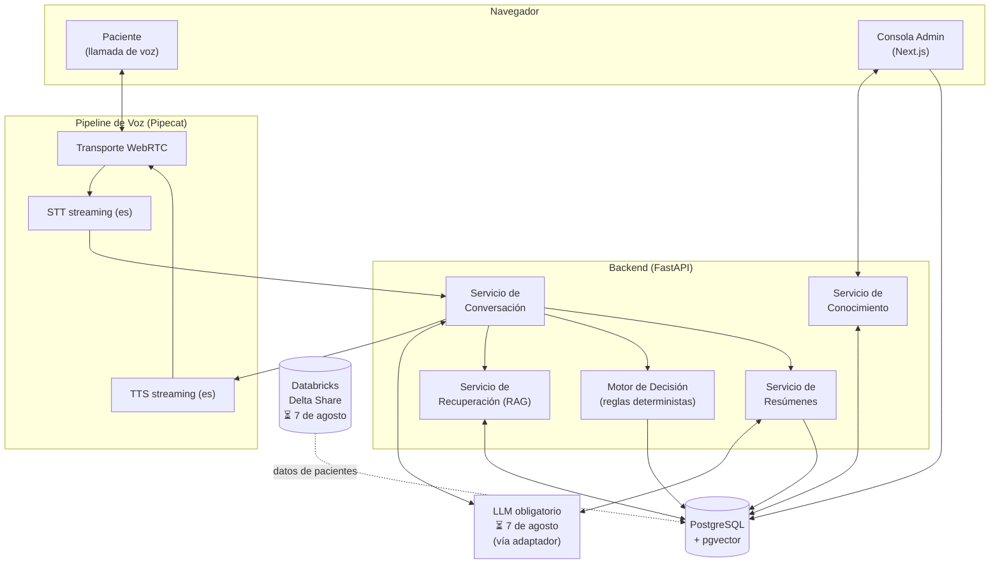
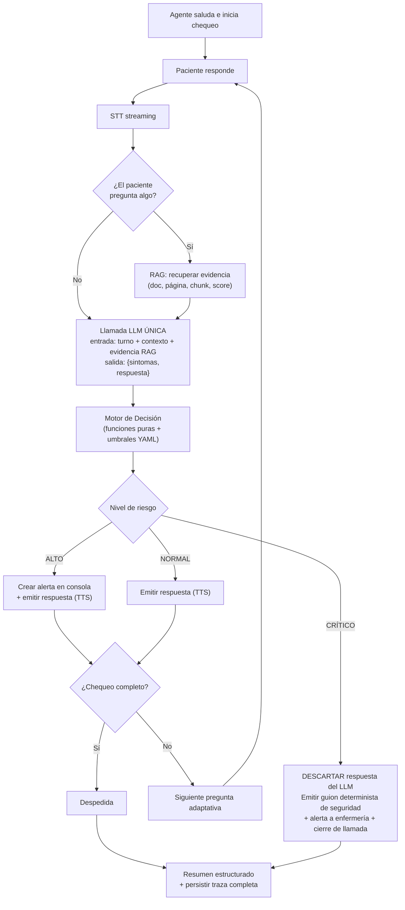

# Arquitectura — Agente de Voz para Seguimiento Post-Operatorio

| Campo | Valor |
|---|---|
| Estado | Borrador — a la espera de materiales oficiales (⏳ 7 de agosto) |
| Última actualización | 2026-07-24 |
| Documentos relacionados | [prd.md](prd.md) · [decision-log.md](decision-log.md) · [tech-stack.md](tech-stack.md) |

> Las herramientas concretas de cada componente se fijan en [tech-stack.md](tech-stack.md). Este documento describe módulos, contratos y flujos, que se mantienen estables aunque cambien las herramientas.

---

## 1. Vista general



Principios (ver [decision-log.md](decision-log.md)):

1. **El LLM nunca decide alertas** — las decisiones clínicas son reglas deterministas (ADR-001).
2. **Toda respuesta clínica sale del RAG**, nunca del conocimiento interno del modelo (ADR-005).
3. **El LLM es intercambiable** — capa adaptadora, porque el modelo obligatorio se anuncia el 7 de agosto (ADR-002).
4. **Nada es caja negra** — cada turno persiste su traza completa (§6).

## 2. Pipeline de voz

Cadena por componentes en streaming (ADR-003), orquestada con Pipecat:

```
micrófono (navegador) → WebRTC → STT streaming → Servicio de Conversación
                                                        ↓ (tokens en streaming)
altavoz (navegador)   ← WebRTC ← TTS streaming  ←  respuesta del LLM
```

- **Transporte:** WebRTC navegador↔servidor (sin telefonía real, como exige el reto).
- **Interrupciones (barge-in):** si el paciente habla mientras el agente responde, se cancela el TTS y se procesa la nueva entrada.
- **Latencia objetivo:** < 1.5 s por turno (RNF-02). STT, LLM y TTS operan en streaming, el TTS comienza con la primera oración generada, y hay **una sola llamada LLM por turno** (ADR-006) — el presupuesto no sobrevive dos llamadas secuenciales.
- **Español:** STT configurado `es`/`es-CO`; TTS ElevenLabs `eleven_flash_v2_5` con voz nativa latina/colombiana validada contra el dataset (los 5 pts de regionalismo; plan B: Azure `es-CO`, ver [tech-stack.md](tech-stack.md) y ADR-007).

## 3. Módulos

### 3.1 Servicio de Conversación
- Mantiene el contexto y el turno de la conversación.
- Hace preguntas adaptativas según lo que reporta el paciente (dolor → escala 0–10; fiebre → temperatura; etc.).
- **Una sola llamada LLM por turno (ADR-006):** la salida estructurada del modelo contiene `{sintomas, respuesta}` — la extracción de entidades y la redacción de la respuesta salen juntas, no en llamadas separadas.
- **El Motor de Decisión corre entre el LLM y el TTS:** evalúa `sintomas` antes de emitir audio. Si el nivel es CRÍTICO, la respuesta del LLM **se descarta** y se emite un guion determinista de seguridad (ADR-006).
- Si el paciente pregunta algo, la evidencia RAG se recupera y se inyecta en la llamada; **prohibido** responder desde el conocimiento interno del modelo. Sin evidencia suficiente → lo dice y ofrece escalar.
- Prompts como plantillas versionadas en `/prompts` (nunca hardcodeados).

### 3.2 Servicio de Conocimiento
- Alta: recibe PDF → parseo → chunking (con metadatos de documento y página) → embeddings → indexación en pgvector. Sin reinicios (RF-06).
- Baja: elimina el documento y **todos sus vectores en la misma transacción** — el agente olvida de inmediato (RF-07, gate G5).
- Expone: listado de documentos, nº de chunks, estado de embeddings, última actualización.

### 3.3 Servicio de Recuperación (RAG)
Contrato de respuesta:

```json
{
  "answer": "…",
  "confidence": 0.91,
  "sources": [
    { "document": "colecistectomia.pdf", "page": 17, "chunk_id": "…" }
  ]
}
```

- Búsqueda por similitud (pgvector) con umbral de confianza; bajo el umbral → "no tengo evidencia suficiente".
- **Sin clasificador previo de turno** (ADR-005): la recuperación corre siempre que el paciente formula una pregunta — pgvector es local y cuesta milisegundos — y el prompt ignora contexto irrelevante. Si el LLM obligatorio soporta tool-calling, el RAG se expone como tool y el propio modelo decide invocarlo.
- Embeddings **multilingües** (el corpus y las consultas son en español) — modelo por confirmar según el LLM obligatorio (⏳, [tech-stack.md](tech-stack.md)); preferir hosteados (gate de 15 min).

### 3.4 Motor de Decisión (determinista, sin IA)
- Reglas como **funciones Python puras** — una por regla, con nombre y descripción legible — y los **umbrales** (temperatura, escala de dolor) en un YAML pequeño. Deliberadamente **no** es un motor de reglas genérico ni un DSL (ADR-001): la rúbrica premia precisión y explicabilidad, no frameworks.
- Salida: nivel de riesgo (`NORMAL | ALTO | CRÍTICO`) + reglas disparadas.
- En CRÍTICO, además selecciona el **guion determinista de seguridad** que reemplaza la respuesta del LLM (ADR-006).
- 100 % testeable con pruebas unitarias — apunta directo a los 15 pts de "lógica de decisión".
- ⏳ Las reglas de línea base (ver PRD RF-08) se calibran con el dataset del 7 de agosto.

### 3.5 Servicio de Resúmenes
Al cerrar la llamada genera el reporte estructurado (RF-10):

```json
{
  "patient": "…", "surgery": "…", "duration": "…",
  "symptoms": [], "extracted_entities": {},
  "cited_documents": [], "risk_level": "ALTO",
  "triggered_rules": [], "recommendation": "…"
}
```

### 3.6 Consola de Administración
- Documentos: subir PDF, eliminar, chunks, estado de embeddings, última actualización.
- Conversaciones: historial, transcripción, resumen estructurado.
- Alertas y log de decisiones: reglas disparadas, nivel de riesgo, traza por respuesta.
- Las alertas se refrescan por **polling** (cada pocos segundos) — sin infraestructura WebSocket adicional para esto.

## 4. Flujo de decisión del agente

*(Diagrama exigido como entregable del reto — exportar a imagen para el repo.)*



Notas del flujo:

- La extracción de síntomas y la respuesta salen de **una sola llamada LLM** (ADR-006); el Motor de Decisión corre **antes** del TTS, de modo que ninguna respuesta llega al paciente sin pasar por las reglas.
- Si la evidencia recuperada no supera el umbral de confianza, la respuesta generada declara explícitamente que no hay evidencia suficiente y ofrece escalar (ADR-005).
- En CRÍTICO no se confía ni la redacción al LLM: el guion de seguridad es texto fijo, revisado y testeable.

## 5. Modelo de datos (esencial)

| Tabla | Contenido |
|---|---|
| `patients` | Datos del paciente y cirugía (desde el dataset ⏳) |
| `documents` | Documento, estado de indexación, nº chunks, timestamps |
| `chunks` | Texto, embedding (pgvector), documento, página |
| `conversations` | Llamada: paciente, inicio/fin, estado |
| `turns` | Turno a turno: transcripción, respuesta emitida, latencias **y traza completa** — chunks recuperados (doc, página, chunk_id, score), confianza, reglas evaluadas/disparadas, respuesta final y override crítico si aplicó (RF-05) |
| `alerts` | Nivel, reglas, contexto, estado de atención |
| `summaries` | JSON del resumen estructurado por llamada |

## 6. Trazabilidad end-to-end

Cada respuesta clínica persiste en su turno (`turns`):

```
pregunta → chunks recuperados (doc, página, chunk_id, score) → confianza
→ reglas evaluadas y disparadas → respuesta final emitida
```

La consola permite auditar cualquier respuesta hasta su fuente. Esto cubre RF-05 y alimenta los 20 pts de "RAG + trazabilidad" de la rúbrica.

## 7. Estructura del repositorio (monorepo)

```
/apps
  /frontend        # Next.js: consola admin + cliente de llamada
                   #   (los ~5 tipos TS que espeja del backend, escritos a mano)
  /backend         # FastAPI: UNA sola app con módulos internos
    /app
      /voice       # pipeline Pipecat (transporte, STT, TTS, turnos)
      /rag         # ingesta, chunking, embeddings, retrieval
      /decision    # reglas puras + umbrales YAML + tests
      /summary     # resúmenes estructurados
/prompts           # plantillas de prompts versionadas
/docs              # este directorio
seed.py            # carga dataset (Delta Share) + PDFs de ejemplo
docker-compose.yml
README.md          # arranque en ≤15 min (gate G2)
LICENSE            # MIT (obligatorio, raíz)
```

Deliberadamente **sin `/packages` compartidos** (ADR-008): la modularidad que evalúa la rúbrica se logra con límites de módulo dentro de una app, sin la fricción de paquetes instalables ni codegen de tipos para un proyecto de una persona y 3 días.

## 8. Despliegue y reproducibilidad

- `docker compose up` levanta: frontend, backend (incluye pipeline de voz), PostgreSQL+pgvector.
- **Imágenes preconstruidas en GHCR (ADR-009):** el compose de evaluación descarga imágenes ya publicadas en GitHub Container Registry en lugar de compilar — el gate de 15 min se gana en el registry, no en el README. Build desde fuente documentado como plan B. Ensayo cronometrado en máquina limpia el día 3.
- `.env.example` documentado; credenciales de evaluación incluidas en la entrega (lo permite el reto).
- Semilla de datos: **`seed.py`** carga pacientes del dataset (⏳ Delta Share, cliente `delta-sharing`) y 1–2 PDFs clínicos de ejemplo, para que el evaluador tenga una demo funcional inmediata.

## 9. ⏳ Decisiones abiertas hasta el 7 de agosto

| Decisión | Depende de |
|---|---|
| Cliente/API del LLM y formato de streaming | Modelo obligatorio |
| Modelo de embeddings definitivo | Compatibilidad/costos con el LLM obligatorio |
| Reglas clínicas definitivas y vocabulario de síntomas | Dataset real |
| Esquema de ingesta desde Delta Share | Credenciales y esquema del dataset |
