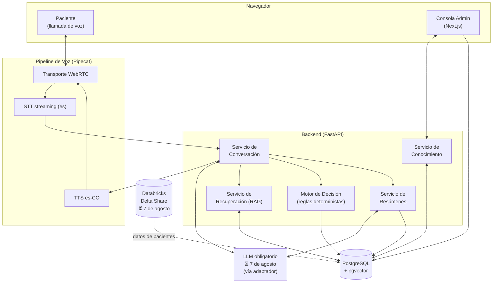
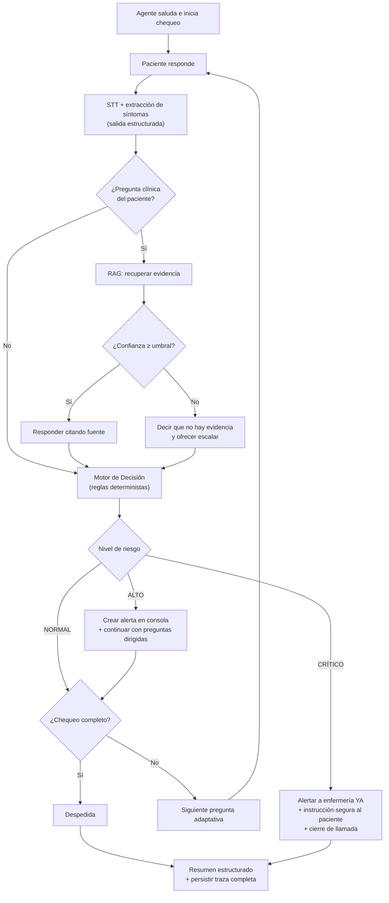

# Arquitectura — Agente de Voz para Seguimiento Post-Operatorio

| Campo | Valor |
|---|---|
| Estado | Borrador — a la espera de materiales oficiales (⏳ 7 de agosto) |
| Última actualización | 2026-07-24 |
| Documentos relacionados | [prd.md](prd.md) · [decision-log.md](decision-log.md) · [tech-stack.md](tech-stack.md) |

> Las herramientas concretas de cada componente se fijan en [tech-stack.md](tech-stack.md). Este documento describe módulos, contratos y flujos, que se mantienen estables aunque cambien las herramientas.

---

## 1. Vista general



Principios (ver [decision-log.md](decision-log.md)):

1. **El LLM nunca decide alertas** — las decisiones clínicas son reglas deterministas (ADR-001).
2. **Toda respuesta clínica sale del RAG**, nunca del conocimiento interno del modelo (ADR-005).
3. **El LLM es intercambiable** — capa adaptadora, porque el modelo obligatorio se anuncia el 7 de agosto (ADR-002).
4. **Nada es caja negra** — cada turno persiste su traza completa (§6).

## 2. Pipeline de voz

Cadena por componentes en streaming (ADR-003), orquestada con Pipecat:

```
micrófono (navegador) → WebRTC → STT streaming → Servicio de Conversación
                                                        ↓ (tokens en streaming)
altavoz (navegador)   ← WebRTC ← TTS streaming  ←  respuesta del LLM
```

- **Transporte:** WebRTC navegador↔servidor (sin telefonía real, como exige el reto).
- **Interrupciones (barge-in):** si el paciente habla mientras el agente responde, se cancela el TTS y se procesa la nueva entrada.
- **Latencia objetivo:** < 1.5 s por turno (RNF-02). STT, LLM y TTS operan en streaming; el TTS comienza con la primera oración generada.
- **Español colombiano:** STT configurado `es`/`es-CO`; TTS con voz neuronal colombiana nativa (los 5 pts de regionalismo de la rúbrica).

## 3. Módulos

### 3.1 Servicio de Conversación
- Mantiene el contexto y el turno de la conversación.
- Hace preguntas adaptativas según lo que reporta el paciente (dolor → escala 0–10; fiebre → temperatura; etc.).
- Extrae síntomas y entidades de cada turno del paciente (salida estructurada del LLM) y los pasa al Motor de Decisión.
- Para toda pregunta clínica, consulta al Servicio de Recuperación; **prohibido** responder desde el conocimiento interno del modelo. Sin evidencia suficiente → lo dice y ofrece escalar.
- Prompts como plantillas versionadas en `/prompts` (nunca hardcodeados).

### 3.2 Servicio de Conocimiento
- Alta: recibe PDF → parseo → chunking (con metadatos de documento y página) → embeddings → indexación en pgvector. Sin reinicios (RF-06).
- Baja: elimina el documento y **todos sus vectores en la misma transacción** — el agente olvida de inmediato (RF-07, gate G5).
- Expone: listado de documentos, nº de chunks, estado de embeddings, última actualización.

### 3.3 Servicio de Recuperación (RAG)
Contrato de respuesta:

```json
{
  "answer": "…",
  "confidence": 0.91,
  "sources": [
    { "document": "colecistectomia.pdf", "page": 17, "chunk_id": "…" }
  ]
}
```

- Búsqueda por similitud (pgvector) con umbral de confianza; bajo el umbral → "no tengo evidencia suficiente".
- Embeddings **multilingües** (el corpus y las consultas son en español) — modelo por confirmar según el LLM obligatorio (⏳, [tech-stack.md](tech-stack.md)).

### 3.4 Motor de Decisión (determinista, sin IA)
- Reglas configurables (archivo YAML/JSON versionado), evaluadas sobre los síntomas estructurados extraídos por el Servicio de Conversación.
- Salida: nivel de riesgo (`NORMAL | ALTO | CRÍTICO`) + reglas disparadas.
- 100 % testeable con pruebas unitarias — apunta directo a los 15 pts de "lógica de decisión".
- ⏳ Las reglas de línea base (ver PRD RF-08) se calibran con el dataset del 7 de agosto.

### 3.5 Servicio de Resúmenes
Al cerrar la llamada genera el reporte estructurado (RF-10):

```json
{
  "patient": "…", "surgery": "…", "duration": "…",
  "symptoms": [], "extracted_entities": {},
  "cited_documents": [], "risk_level": "ALTO",
  "triggered_rules": [], "recommendation": "…"
}
```

### 3.6 Consola de Administración
- Documentos: subir PDF, eliminar, chunks, estado de embeddings, última actualización.
- Conversaciones: historial, transcripción, resumen estructurado.
- Alertas y log de decisiones: reglas disparadas, nivel de riesgo, traza por respuesta.

## 4. Flujo de decisión del agente

*(Diagrama exigido como entregable del reto — exportar a imagen para el repo.)*



## 5. Modelo de datos (esencial)

| Tabla | Contenido |
|---|---|
| `patients` | Datos del paciente y cirugía (desde el dataset ⏳) |
| `documents` | Documento, estado de indexación, nº chunks, timestamps |
| `chunks` | Texto, embedding (pgvector), documento, página |
| `conversations` | Llamada: paciente, inicio/fin, estado |
| `turns` | Turno a turno: audio→texto, respuesta, latencias |
| `traces` | Por respuesta clínica: pregunta, chunks recuperados, confianza, reglas disparadas, respuesta final (RF-05) |
| `alerts` | Nivel, reglas, contexto, estado de atención |
| `summaries` | JSON del resumen estructurado por llamada |

## 6. Trazabilidad end-to-end

Cada respuesta clínica persiste en `traces`:

```
pregunta → chunks recuperados (doc, página, chunk_id, score) → confianza
→ reglas evaluadas y disparadas → respuesta final emitida
```

La consola permite auditar cualquier respuesta hasta su fuente. Esto cubre RF-05 y alimenta los 20 pts de "RAG + trazabilidad" de la rúbrica.

## 7. Estructura del repositorio (monorepo)

```
/apps
  /frontend        # Next.js: consola admin + cliente de llamada
  /backend         # FastAPI: servicios + pipeline de voz
/packages
  /rag             # ingesta, chunking, embeddings, retrieval
  /decision_engine # reglas deterministas + tests
  /shared_types    # contratos (Pydantic / TypeScript)
/prompts           # plantillas de prompts versionadas
/docs              # este directorio
docker-compose.yml
README.md          # arranque en ≤15 min (gate G2)
LICENSE            # MIT (obligatorio, raíz)
```

## 8. Despliegue y reproducibilidad

- `docker compose up` levanta: frontend, backend (incluye pipeline de voz), PostgreSQL+pgvector.
- `.env.example` documentado; credenciales de evaluación incluidas en la entrega (lo permite el reto).
- Semilla de datos: script que carga pacientes del dataset (⏳ Delta Share, cliente `delta-sharing`) y 1–2 PDFs clínicos de ejemplo, para que el evaluador tenga una demo funcional inmediata.

## 9. ⏳ Decisiones abiertas hasta el 7 de agosto

| Decisión | Depende de |
|---|---|
| Cliente/API del LLM y formato de streaming | Modelo obligatorio |
| Modelo de embeddings definitivo | Compatibilidad/costos con el LLM obligatorio |
| Reglas clínicas definitivas y vocabulario de síntomas | Dataset real |
| Esquema de ingesta desde Delta Share | Credenciales y esquema del dataset |
