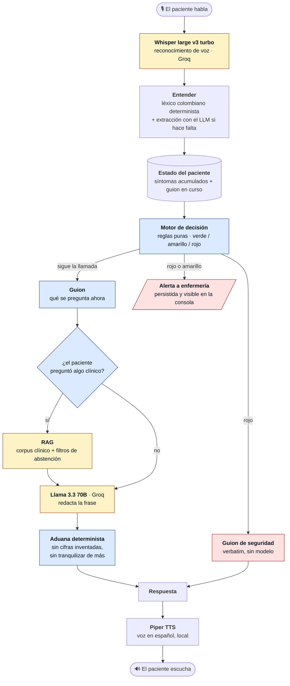
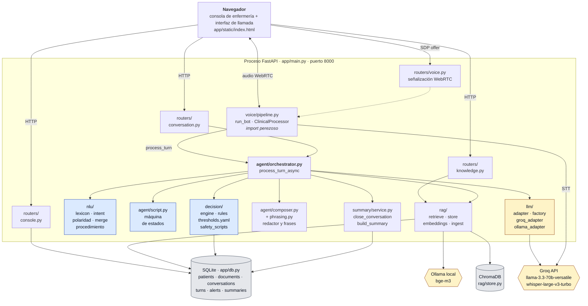
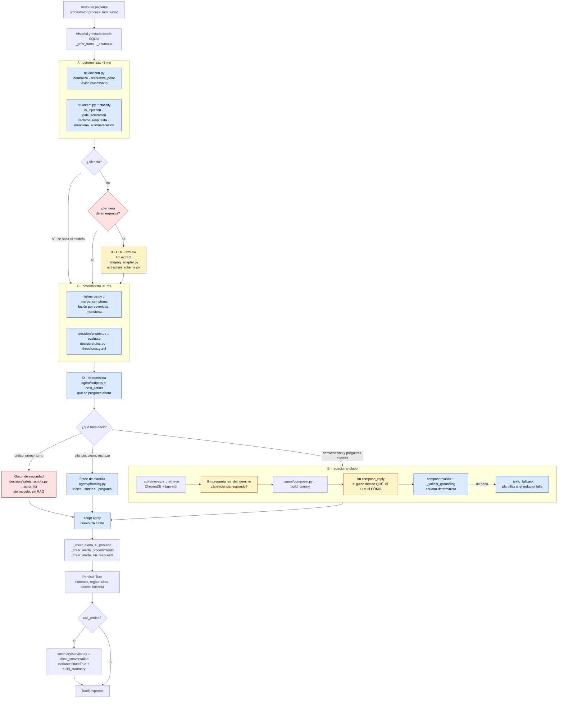
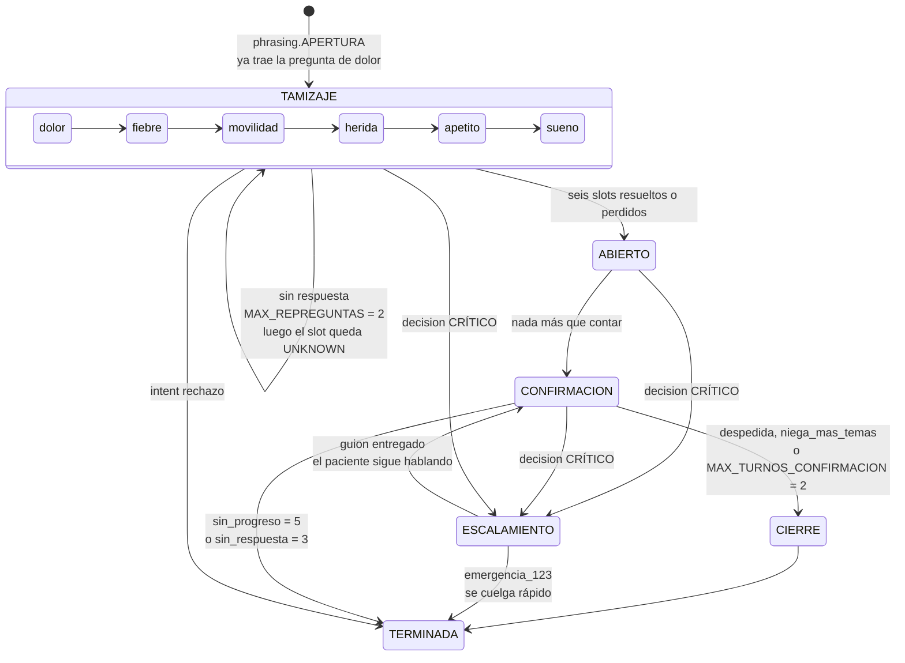
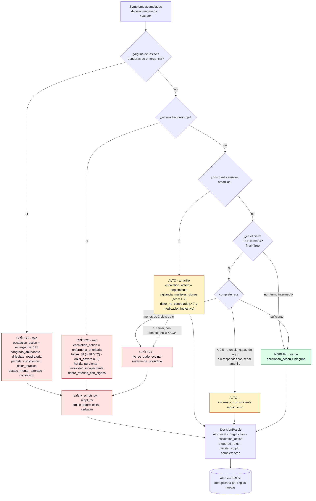
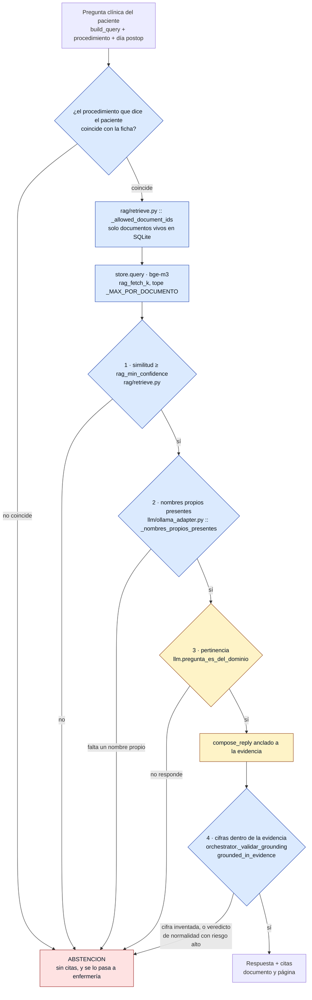

# Arquitectura y flujo de decisión

Entregable 02 del reto. Una vista de conjunto y cinco secciones de detalle: cómo
está montado el sistema, qué pasa en un turno, cómo conduce el agente la
conversación, cómo decide si alerta y cuándo se calla porque no sabe.

**Cada caja lleva el archivo y la función que la implementan.** El README explica
*por qué* está construido así; esto explica *dónde* está.

El principio que ordena todo lo que sigue: **el modelo interpreta, el código
decide.** Ninguna decisión clínica —el nivel de riesgo, la alerta, el guion de
seguridad, qué se pregunta ahora— pasa por el LLM. El modelo solo hace dos cosas:
extraer lo que el paciente quiso decir y redactar la frase.

---

## Vista de conjunto

El recorrido completo de una respuesta, desde que el paciente deja de hablar hasta
que vuelve a oír al agente. Unos **1.400 ms** típicos.



<sub>Azul: determinista, el código decide. Ámbar: el modelo. Rojo: la ruta de escalamiento.</sub>

El **estado del paciente** es acumulativo y vive en la base de datos, no en el
contexto del modelo: cada turno añade lo que se entendió y nada lo baja de nivel.
Por eso el ciclo vuelve a empezar arriba con todo lo que ya se sabía.

Tres cosas que este dibujo ya dice, y que el resto del documento solo detalla:

- **El motor de decisión va antes que el guion y antes del modelo.** Si el cuadro
  es rojo, la respuesta es un guion verbatim y la alerta ya está creada: esa rama
  no toca el LLM ni el RAG, así que ni un modelo caído ni uno manipulado pueden
  suprimir un escalamiento.
- **El RAG solo se consulta si el paciente preguntó algo clínico** — de media,
  0,50 consultas por llamada al modelo. El resto del tiempo el agente está
  preguntando, no respondiendo.
- **Nada de lo que redacta el modelo sale sin pasar por la aduana**, que es código
  y no otro modelo.

Cada pieza, con su archivo y su función, en las cinco secciones que siguen.

---

## 1. Arquitectura de componentes

Un proceso, un puerto, dos almacenes sin servidor. No hay Docker, ni Node, ni
PostgreSQL: el porqué de cada ausencia está en el README.



<sub>Azul: determinista. Ámbar: modelo. Gris: almacenamiento.</sub>

### El pipeline de voz

Siete etapas de Pipecat, sin ningún `STTService` ni `TTSService` a medida
(`app/voice/pipeline.py :: run_bot`). El `VADProcessor` va **explícito en la
cadena** porque `TransportParams` descarta `vad_analyzer` en silencio, y sin VAD
`GroqSTTService` no transcribe nada: la llamada entera se leería como silencio.

```mermaid
flowchart LR
    MIC(["micrófono"]) --> TIN["transport.input<br/>SmallWebRTCTransport"]
    TIN --> VAD["VADProcessor<br/>SileroVADAnalyzer"]
    VAD --> STT["GroqSTTService<br/>whisper-large-v3-turbo"]
    STT --> TUR["UserTurnProcessor<br/>fin de turno"]
    TUR --> CLI["ClinicalProcessor<br/>eco · barge-in · silencios<br/>llama a process_turn"]
    CLI --> TTS["TTS · _build_tts<br/>Piper es_MX-claude-high<br/>Kokoro opcional"]
    TTS --> TOUT["transport.output"]
    TOUT --> ALT(["altavoz"])

    classDef det fill:#dbeafe,stroke:#1e40af,color:#0b1220
    class VAD,TUR,CLI det
```



**El orden del borrado no es decorativo.** Tener dos almacenes hace frágil el
conocimiento vivo, así que `rag/ingest.py::delete_document` borra **primero en
ChromaDB y después en SQLite**, y toda consulta filtra por los documentos vivos
de SQLite
(`rag/retrieve.py::_allowed_document_ids`). Un vector huérfano no puede servirse
aunque el proceso muera a mitad de camino. Lo comprueba `test_conocimiento_vivo`.

### Superficie HTTP

| Método y ruta | Archivo |
|---|---|
| `POST /conversation/turn` | `routers/conversation.py` |
| `GET /conversation/apertura` | `routers/conversation.py` |
| `POST /conversation/{conversation_id}/close` | `routers/conversation.py` |
| `GET · POST /knowledge/documents` · `DELETE /knowledge/documents/{document_id}` | `routers/knowledge.py` |
| `GET /console/patients` · `/console/alerts` · `/console/conversations` · `/console/conversations/{id}` | `routers/console.py` |
| `POST /console/alerts/{alert_id}/attend` | `routers/console.py` |
| `GET /voice/status` · `POST · PATCH /voice/offer` | `routers/voice.py` |
| `GET /health` · `GET /` | `main.py` |

Pipecat se importa **perezosamente** desde `routers/voice.py`: quien nunca abre
una llamada no paga el arranque de la pila de voz.

---

## 2. Flujo de un turno

Lo que ocurre entre que el paciente termina de hablar y el agente contesta. Las
etiquetas A–E son las mismas que usa el README.



**La ruta crítica es la más corta y no pasa por el modelo.** Si el léxico levanta
una bandera de emergencia, el turno salta B y E: se emite
`decision.safety_script` y se alerta. Ni un modelo caído ni un modelo manipulado
pueden suprimir un escalamiento — hay un test que lo comprueba apuntando el
adaptador a un puerto muerto.

El silencio corta por la misma razón de fondo: no hay nada que extraer de él, y
gastar segundos de modelo solo alarga la espera de alguien que ya no contesta
(`orchestrator.py`, `intent.classify(text) == "silencio"`).

Todo lo que decide el turno vive en `CallState` (`agent/script.py`), que se
persiste en la fila del `Turn` — **no en el contexto del modelo**. Eso recorta
unos 800 tokens por turno y elimina la deriva del modelo que se olvida de lo que
ya preguntó.

---

## 3. Máquina de estados del guion

Las seis preguntas del tamizaje son código, no una instrucción en el prompt. Una
inyección de prompt no puede saltarse una pregunta ni cambiar una decisión, y las
frases se pueden pre-sintetizar en audio.



Tres contadores gobiernan la salida, y son distintos a propósito
(`agent/script.py`):

| Contador | Tope | Qué pasa al llegar |
|---|---:|---|
| `repreguntas[slot]` | `MAX_REPREGUNTAS = 2` | El slot se marca UNKNOWN y el guion sigue. Nunca `False`: un dato que no se obtuvo no es un dato negativo. |
| `sin_progreso` | `SIN_PROGRESO_OFRECER_SALIDA = 3` | Se le ofrece al paciente que lo llame una enfermera. |
| `sin_progreso` | `SIN_PROGRESO_CERRAR = 5` | Se cierra la llamada — y `evaluate(final=True)` decide qué era. |
| `sin_respuesta` | `MAX_SILENCIOS = 3` | Escalera de presencia: **sondear → avisar → colgar**, con alerta de llamada sin respuesta. |
| `turnos` en confirmación | `MAX_TURNOS_CONFIRMACION = 2` | Se cierra. Una pregunta clínica contestada **no** gasta este presupuesto. |

Los silencios cuentan **seguidos**: cualquier cosa que diga el paciente devuelve
el contador a cero. Un silencio suelto en mitad de una llamada normal no puede
acercarla a colgarse. La parte pura de esa escalera —incluido el escalón GENTLE
(*"tómese su tiempo"*), que se emite localmente y ni siquiera crea un turno— vive
en `app/voice/silence.py`; el reloj está en `ClinicalProcessor`.

---

## 4. Flujo de decisión y escalamiento

Código puro, sin IA y sin motor de reglas genérico. Los umbrales salen de
`decision/thresholds.yaml`, calibrados contra las 160 trayectorias del dataset y
su `label_ground_truth`.



**Señales amarillas** (`rules.yellow_signals`), suman 1 cada una y con dos basta:
dolor ≥ 5, temperatura ≥ 37.3 °C, eritema leve en la herida, apetito muy
disminuido, sueño muy alterado.

**La política de incertidumbre solo corre al cerrar y solo sube.** Un slot sin
responder nunca reduce el riesgo; una llamada que no se pudo evaluar no se
despide como si el paciente estuviera bien. Es un falso positivo comprado a
propósito para cerrar una vía de falso negativo — la asimetría que pide la
rúbrica.

Sobre los 160 casos del dataset, las reglas aciertan 152 (95,0 %) con **cero
falsos negativos**; los ocho errores son verdes escalados a amarillo. La
derivación completa está en [`calibracion-triage.md`](calibracion-triage.md) y se
verifica con `app/tests/test_triage_from_trajectories.py`.

Lo que queda registrado cuando se decide alertar —y el resumen de cierre con
paciente, procedimiento, síntomas, decisiones turno a turno, citas y próximos
pasos— lo construye `summary/service.py :: build_summary`.

---

## 5. Cuándo el agente dice "no sé"

Que la similitud vectorial sea alta **no significa** que la evidencia responda:
medido sobre 25 preguntas, *"¿cuál es el horario de visitas?"* puntúa 0.868 y
*"¿cuándo me quitan los puntos?"* puntúa 0.795. La ajena gana, porque todo el
corpus es texto médico postoperatorio y el coseno mide cercanía temática, no
respuesta. Ningún umbral separa esas dos, así que hay cuatro filtros encadenados
y **solo uno es un modelo**.



El filtro del procedimiento existe porque el corpus está indexado **por
procedimiento**: si el paciente dice que lo operaron de otra cosa, recuperar con
la ficha discrepante solo puede citar documentos de la otra cirugía —una
afirmación falsa *con fuente*, que es peor que no responder—. Ni RAG ni citas: el
agente declara el límite y se crea una alerta para que alguien verifique el
registro (`_crear_alerta_procedimiento`).

La cadena pasó de **0/10 preguntas inventadas rechazadas a 9/10**, conservando
12/15 de las legítimas. El detalle está en
[`calibracion-rag.md`](calibracion-rag.md).

---

## Cómo comprobar que este diagrama es el código

Todo símbolo citado arriba existe en el repositorio. Para verificarlo de un
tirón, desde la raíz:

```bash
for s in process_turn_async "engine.py" evaluate next_action apply merge_symptoms \
         retrieve pregunta_es_del_dominio _nombres_propios_presentes \
         grounded_in_evidence _validar_grounding script_for close_conversation \
         build_summary MAX_SILENCIOS SIN_PROGRESO_CERRAR MAX_REPREGUNTAS \
         MAX_TURNOS_CONFIRMACION _allowed_document_ids ClinicalProcessor; do
  printf '%-34s %s\n' "$s" "$(grep -rl -- "$s" apps/backend/app --include='*.py' | head -1)"
done
```

Y la superficie HTTP de la tabla de §1, contra la app en marcha:

```bash
curl -s localhost:8000/openapi.json \
  | python -c "import json,sys; print(*sorted(json.load(sys.stdin)['paths']), sep='\n')"
```

---

**Documentos relacionados:** [`calibracion-triage.md`](calibracion-triage.md) ·
[`calibracion-rag.md`](calibracion-rag.md) · [`metricas.md`](metricas.md) ·
[`spikes-7-agosto.md`](spikes-7-agosto.md) · [`../README.md`](../README.md)
